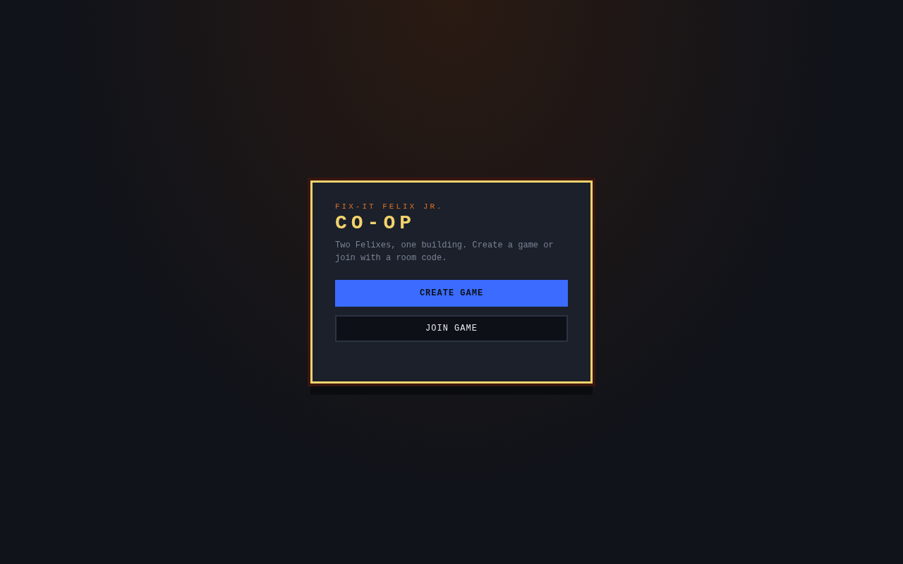
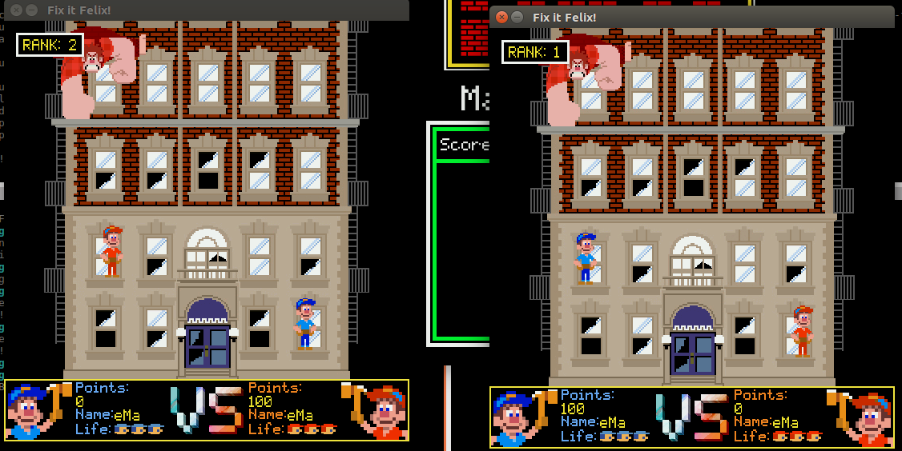

# Felix Fix-It Coop

Two Felixes, one building. A **free, open-source** browser remake you can play with a friend right now.

**[Play in the browser](https://emasuriano.github.io/felix-fix-it-coop/)** — no account, no download, no sign-up. Anyone with a link can join.

## What is this?

A two-player coop game inspired by the Fix-It Felix Jr. arcade cabinet from *Wreck-It Ralph*. You and a friend climb the building, hammer cracked windows, and dodge Ralph's bricks and ducks.

This is a web port of **[Felix Fix It Multiplayer](https://github.com/EmaSuriano/Felix-fix-it-multiplayer)**, a C + SDL remake written by [Emanuel Suriano](https://github.com/EmaSuriano), [Esteban Barrett](https://github.com/Ph003), and [Federico Casabona](https://github.com/FedeCasabona). Huge thanks to them for the original game, sprites, layout, and rules this project follows.

It is an unofficial fan remake, not affiliated with Disney.

The original C + SDL remake this port is based on:

## Play with a friend

1. Open the [game](https://emasuriano.github.io/felix-fix-it-coop/).
2. Click **Create Game**.
3. Copy the invite link and send it to a friend (or paste it in another tab).
4. The match starts as soon as they join.

There is no game server and no login. Rooms are peer-to-peer in the browser. The whole project is MIT licensed, so you can play, fork, and remix it.

## How to play

- **Move:** WASD or arrow keys
- **Hammer:** Space or J. Repairs a damaged window (smashed to cracked to fixed) and scores 100 points. During a pie rush, smashed panes go straight to fixed.
- **Hazards:** falling bricks and flying ducks. A hit on your cell costs a life, then about two seconds of immunity.
- **Lives:** 3 to start. Extra life every 2000 points (max 3).
- **Pie:** sometimes appears on a window. Stand on it or hammer it for about 5 seconds of berserker plus immunity.
- **Stages:** most windows start damaged. When every pane is fixed, the next stage begins with more bricks and ducks.
- **Game over:** when both players are out of lives. Refresh for a new room.

Host is blue; the guest is orange. The host waits until the second player arrives.

## Credits

Original C + SDL multiplayer remake:

- [Emanuel Suriano](https://github.com/EmaSuriano)
- [Esteban Barrett](https://github.com/Ph003)
- [Federico Casabona](https://github.com/FedeCasabona)

This browser version uses [Kaplay](https://kaplayjs.com/) and [Trystero](https://github.com/dmotz/trystero) (`@trystero-p2p/mqtt`), following the [Kaplay Coop Starter](https://github.com/EmaSuriano/kaplay-coop-starter) architecture.

Fix-It Felix Jr. and *Wreck-It Ralph* are (c) Disney. This project is an unofficial fan remake.

## Run it locally

Clone this repo, install the JS packages listed in package.json, then start the Vite dev script (port 3000). Open that localhost URL, create a game, and join from a second tab. Peer connections need a real http origin, not a file URL.

Pushes to main publish to GitHub Pages.

## License

[MIT](LICENSE). Free to play, free to copy, free to change.

